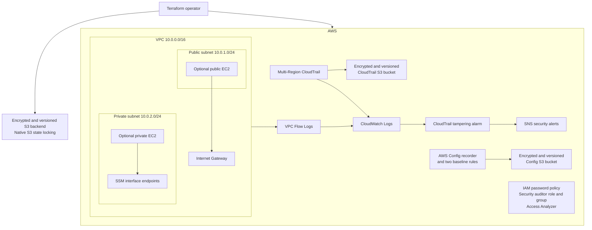

# Architecture

## Scope

This repository implements a compact, single-account AWS security baseline with Terraform. Regional resources default to `us-east-1`, while CloudTrail is configured as a multi-Region trail. It is a portfolio project rather than a production replacement for AWS Organizations or Control Tower.

## High-level design

## Network architecture

The VPC uses `10.0.0.0/16` with one public and one private subnet in the first available Availability Zone.

- The public subnet maps public IP addresses and has a default route to an internet gateway.
- The private subnet has no internet default route and no NAT Gateway.
- The public workload security group permits inbound HTTP and HTTPS, but not SSH.
- The private workload security group has no inbound rules.
- Both workload security groups permit outbound traffic.
- Three interface endpoints—`ssm`, `ssmmessages`, and `ec2messages`—provide the private Systems Manager path.
- The endpoint security group accepts TCP/443 only from the private workload security group.

The deployment is intentionally single-AZ and is designed to demonstrate segmentation rather than production high availability.

## EC2 administration

The two demonstration EC2 instances are optional and disabled by default. When enabled, they:

- Use the latest matching Amazon Linux 2023 AMI.
- Receive an IAM instance profile with `AmazonSSMManagedInstanceCore`.
- Require IMDSv2.
- Use encrypted root EBS volumes.
- Do not use an EC2 key pair.
- Have no inbound SSH access.

The private instance reaches Systems Manager through the VPC endpoints. The public instance can reach regional Systems Manager services through its internet route.

## Identity controls

The account password policy requires a minimum of 14 characters, character complexity, a 90-day maximum age, and prevention of reuse for 24 passwords.

The security read-only role combines the AWS-managed `SecurityAudit` and `ViewOnlyAccess` policies. Its trust policy requires MFA. Existing IAM users can optionally be assigned to the security auditors group, which grants only permission to request that role. An account-level IAM Access Analyzer identifies external access findings.

## Logging and detection

CloudTrail records multi-Region management activity, includes global service events, and enables log-file validation. Events are delivered to:

- A dedicated S3 bucket with encryption, versioning, public-access blocking, and `force_destroy = false`.
- A CloudWatch log group with 30-day retention.

A CloudWatch metric filter detects CloudTrail `StopLogging` and `DeleteTrail` events. One alarm publishes to an SNS topic; its email subscription is optional and requires recipient confirmation.

VPC Flow Logs capture all accepted and rejected traffic and publish to a separate CloudWatch log group with 14-day retention.

AWS Config records supported resources and stores its history in a separate encrypted and versioned S3 bucket. Only two managed rules are enabled:

- `INCOMING_SSH_DISABLED`
- `S3_BUCKET_LEVEL_PUBLIC_ACCESS_PROHIBITED`

## Terraform state

Terraform uses an encrypted S3 backend with native S3 lockfiles. The state-bucket resource enables versioning, blocks public access, and has `prevent_destroy`.

The backend bucket must exist before `terraform init`; Terraform cannot create the bucket it needs in order to initialize itself. If the bucket was bootstrapped separately, it must be imported before this configuration manages it.

## Design decisions and limitations

- No NAT Gateway is created because of recurring cost.
- Interface endpoints avoid public administration paths but have hourly and data-processing charges.
- S3 and EBS encryption use AWS-managed encryption rather than customer-managed KMS keys.
- The design does not include automated remediation, CI/CD security automation, application workloads, or multi-account governance.
- Public ports 80 and 443 exist only to demonstrate a public workload tier.
- Runtime security tests require AWS evidence; Terraform code alone does not prove successful deployment or alert delivery.
