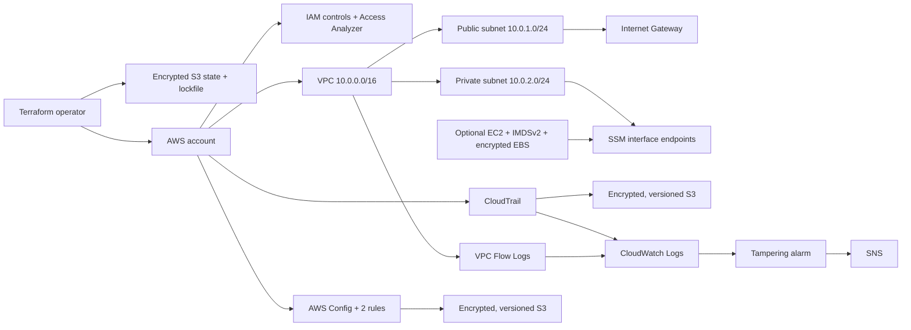

# Secure AWS Landing Zone with Terraform

A portfolio implementation of a security-focused AWS foundation. It demonstrates how identity, network segmentation, centralized audit logging, configuration monitoring, and private administration can be established as code without adding production-scale complexity or a NAT Gateway.

> This is a single-account learning project, not a turnkey enterprise landing zone. Operational test results are intentionally marked as pending until evidence is captured from a deployed AWS account.

## The problem

New AWS environments can accumulate risky defaults: local Terraform state, broad administrative access, public management ports, incomplete audit trails, and configuration drift. This project creates a small, reviewable baseline that gives security teams visibility and gives administrators a safer path to manage optional workloads.

## Architecture

Terraform uses an encrypted, versioned S3 backend with native S3 locking. The landing zone creates one VPC with public and private subnets. The public subnet routes through an internet gateway; the private subnet has no default internet route. Optional Amazon Linux 2023 instances use Session Manager instead of SSH, encrypted root volumes, and IMDSv2. Three interface endpoints provide private connectivity to Systems Manager.

CloudTrail sends validated, multi-Region management events to a dedicated S3 bucket and CloudWatch Logs. A metric filter alarms on `StopLogging` or `DeleteTrail` and publishes to SNS. VPC Flow Logs provide network telemetry. AWS Config records supported resources and evaluates two baseline rules.



See [ARCHITECTURE.md](ARCHITECTURE.md) for trust boundaries, traffic paths, and design decisions.

## Security controls

- Remote encrypted and versioned Terraform state with native S3 locking and deletion protection on the managed backend bucket
- Four S3 Block Public Access settings on state, CloudTrail, and AWS Config buckets
- Account password policy requiring 14 characters, complexity, 90-day maximum age, and 24-password history
- MFA-gated security read-only role using `SecurityAudit` and `ViewOnlyAccess`
- Security auditors group and account-level IAM Access Analyzer
- Public/private subnet separation; no route to an internet gateway from the private subnet
- No inbound SSH rules; private administration through Session Manager interface endpoints
- Optional EC2 disabled by default, with encrypted root EBS and IMDSv2 required
- Multi-Region CloudTrail with log file validation and delivery to S3 and CloudWatch Logs
- CloudTrail tampering metric filter, CloudWatch alarm, and optional SNS email subscription
- VPC Flow Logs for all accepted and rejected traffic with 14-day CloudWatch retention
- AWS Config recording with restricted-SSH and S3 public-access rules

## Repository structure

```text
.
├── README.md
├── ARCHITECTURE.md
└── landing-zone/
    ├── main.tf                 # provider, backend, and state-bucket controls
    ├── variables.tf            # safe deployment inputs
    ├── iam.tf                  # identity baseline and Access Analyzer
    ├── networking.tf           # VPC, subnets, IGW, and routes
    ├── security-groups.tf      # public/private workload boundaries
    ├── ec2.tf                  # optional hardened demo instances
    ├── ssm.tf                  # instance role and private SSM endpoints
    ├── cloudtrail.tf           # audit trail and S3 destination
    ├── cloudwatch.tf           # CloudTrail log delivery role
    ├── cloudwatch-alerts.tf    # tampering detection and SNS
    ├── vpc-flow-logs.tf        # network telemetry
    ├── aws-config.tf           # recorder, bucket, and two rules
    └── outputs.tf
```

## Prerequisites

- Terraform `>= 1.10.0`
- An AWS account and AWS CLI credentials with permission to create the documented resources
- An existing S3 backend bucket named in `landing-zone/main.tf`; backend bootstrapping is a separate step
- Acknowledgement that IAM, S3 bucket names, and AWS Config resources can conflict with existing account resources
- Cost review, especially for interface endpoints, AWS Config, logs, and optional EC2

Do not put credentials, account IDs, email addresses, or secrets in committed variable files.

## Deploy

From `landing-zone/`:

```bash
terraform init
terraform fmt -check
terraform validate
terraform plan
terraform apply
```

The backend bucket must exist before `terraform init`. If it was created outside this configuration, import it before managing it here.

To add existing IAM auditors or an SNS email subscription, use uncommitted CLI variables or an ignored local `.tfvars` file:

```hcl
security_auditor_user_names = ["existing-user"]
security_alert_email        = "security-team@example.com"
```

SNS email delivery starts only after the recipient confirms the subscription.

## Optional EC2 demonstration

EC2 is off by default. Enable it only for a short validation session:

```bash
terraform plan -var='deploy_demo_ec2=true'
terraform apply -var='deploy_demo_ec2=true'
```

No key pair is configured and no security group permits port 22. The private instance depends on the SSM interface endpoints; the public instance can reach regional SSM services through its internet route. Disable both after testing by applying `deploy_demo_ec2=false`.

## Validation status

Static inspection confirms that the Terraform expresses the controls listed above. It does **not** prove that resources are currently deployed or working. Runtime checks—CloudTrail delivery, SNS alarm delivery, Flow Log records, Config evaluation, and Session Manager access—remain `NOT YET VERIFIED` until AWS evidence is captured.

## Cost and cleanup

The most likely recurring charges come from the three interface endpoints, AWS Config, CloudWatch Logs and Flow Logs, EC2/EBS when enabled, and S3 requests/storage. Stopped instances can still incur EBS storage charges, and interface endpoints charge hourly.

Safe cleanup order:

1. Set `deploy_demo_ec2=false` and apply, or otherwise destroy the optional instances.
2. Destroy paid monitoring and interface endpoint resources.
3. Destroy the remaining landing-zone resources.
4. Preserve the backend bucket unless intentionally migrating state locally.
5. Delete the backend bucket only after state is migrated, versioned objects are emptied, and `prevent_destroy` is deliberately addressed.

Never casually destroy the backend: it contains Terraform's record of the environment.

## Lessons and future improvements

The project demonstrates that private management does not require inbound SSH or a NAT Gateway, but endpoint-based access has its own recurring cost. It also highlights the bootstrap boundary created when Terraform manages the same bucket used as its backend.

Reasonable future projects include AWS Organizations/Control Tower, centralized multi-account logging, customer-managed KMS keys, automated remediation, and a dedicated CI/CD security pipeline. They are intentionally outside this repository's scope.
